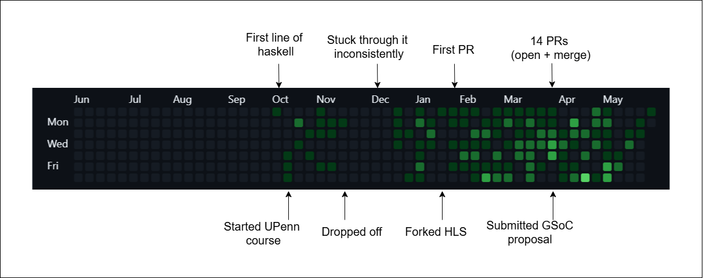

+++
title = "Contributing to Haskell Through a Beginner’s Lens"
date = 2026-05-31

[taxonomies]
authors = ["Vidit Odedra"]
categories = ["Guide"]
tags = ["Contribution", "Open Source", "Summer of Code", "Haskell", "Personal Experience"]
+++

October 2025 was when I wrote my first line of Haskell. Fast forward to May 2026, I am consistently contributing to the Haskell Language Server (HLS) and my Google Summer of Code proposal also got accepted. This blog is a mix of my personal experiences along with general learnings that could help beginners to start contributing to Haskell repositories.

<!-- more -->

I came across Haskell as a language through X creator ( formerly twitter ), Dmitrii Kovanikov. I had experience with TypeScript, so types weren't new to me. Haskell though, made me feel like I'd only ever seen the surface of what a type system could be. Like any other student, my first intuition was to do a university course. I found and participated in the University of Pennsylvania’s (UPenn) Haskell course. It is a 12-week course, fully textual and fully assignment oriented. Solid structure, but honest warning, it gets boring. I barely made it through.

This was the point where I wanted to go beyond assignments, because building a real project felt like a far better way to truly understand the concepts. I had two ideas in mind: a small compiler or a chess engine, with the former seeming much more approachable because of the abundance of available resources. Around this time, I also interacted with an HLS maintainer for the first time, who guided me through setting up HLS and suggested a few projects to explore. I followed the instructions, built HLS locally, and started browsing through the issues while slowly setting up my compiler project on the side. That’s when I stumbled upon a feature request interesting enough to completely pull me away from the project idea and make me go all in on contributing instead. It was also the very first issue I had ever worked on, and going through the full contribution cycle taught me more about git than my previous two years of casually using it ever did.

Since then, I have made multiple contributions to HLS. The biggest challenge I faced initially was to find good issues to work on. I have made a small checklist that I use to find issues to work on :

1. Don't over-filter when searching for issues. Most repos have "good first issues", feel free to explore and solve them, but avoid narrowing your search too much upfront.
2. Make sure to first and foremost, replicate the issue locally. All issues have replication steps and environments specified in their description.
3. Visualise the fix. Generally it is a good idea to describe the solution or procedure to follow in the comments.

The more important thing to keep in mind is working on issues that are impactful. A great way to identify these, is to simply ask. Haskell’s official website has a community page where you can find ways to contact other fellow haskellers. For example the HLS community is fairly active on Element, and like most open source communities they'll be happy to point you toward meaningful issues if you're not sure where to start.

Anyway, it's 2026 and having any tech conversation without mentioning AI would be criminal. Haskell, of all the languages I have ever learned, has one of the steepest learning curves, so it would only make sense to use these tools during this process. I still am an old head when it comes to AI usage and writing code with it. I heavily believe that handwriting code builds muscle memory and improves your understanding. Don’t get me wrong, I did extensively generate code, but also made sure to follow these rules :

1. Never use a harness, at least in your early learning phase. Harnesses are really good at finding where to write a particular piece of code and hence eliminate the entire process of exploring different files and looking over where to write code. This process despite being unrewarding can help you gather a lot of context of the codebase. This is how I have personally found many potential next issues to work on.
2. The old way of using web LLM providers to ask questions and then type them or worst case scenario copy and manually paste is what I follow and has helped me.
3. Also, Never let your AI tool write comments. GHC, HLS and other Haskell repositories follow Haddock comments. Handwriting this yourself at least makes sure that if a function is black-box coded, you at least know what it is supposed to do. It is also noteworthy to mention in the comment if it is actually black-box coded, this can help improve the review process.

With this we have covered how to find issues and start contributing to them. Now, let’s talk about something equally important: contribution variety. Large codebases like HLS and GHC are made up of many different areas, each offering a unique experience. During my contribution journey, I worked on multiple parts of HLS like different plugins, Cabal-related issues, Stack builds, and even Git workflows. Every area came with its own flavor, challenges, and way of thinking. Early on, trying to maximize the breadth of your contributions is extremely valuable. Big projects need people with different skill sets. Some contributors focus on feature delivery, while others care deeply about performance, tooling, infrastructure, or developer experience. Exploring different areas helps you discover the kind of contributor you naturally are and where you can have the biggest impact on the ecosystem. In many ways, contributing to such a project felt like building a giant bowl of sundae, and I made sure to fill my bowl to the brim.

I want to share one more extremely underrated tip that could help you a lot in the beginning, which is to study already merged pull requests (PRs). Instead of only trying to solve fresh issues, pick around 5–10 closed issues with merged PRs and go through the entire contribution cycle yourself. Understand the original problem, study the approach the contributor took, read through the review discussions, and observe how the final solution evolved over time. Repeating this process across multiple PRs helps you gradually build a surprising amount of “tribal knowledge” about the codebase, workflows, and maintainer expectations. Over time, this understanding can significantly improve the quality of your own initial contributions.

Once you get deep into the contribution cycle, chances are you’ll start wanting more. Exploring Summer of Code programs is a great next step if you find yourself in that position. Every year, Haskell participates in such programs through either Google Summer of Code (GSoC) or Haskell Summer of Code (HSoC). These programs give you the opportunity to work on highly requested features and see them through end-to-end, from design discussions all the way to implementation while having mentors to turn to throughout the process. As part of GSoC 2026, I’ll be contributing to HLS through the “Goto Dependency Definition” project. The goal is to build mechanisms that allow developers to jump directly to third-party dependency definitions with a single click. Sounds interesting, doesn’t it?

I’ll end this discussion with a special thanks to the Haskell Language Server maintainers and community for their guidance, patience, and constant support throughout my journey. Since contributing to HLS, I’ve also explored several other open source repositories, many of which are now heavily driven by automated review bots and impersonal workflows. The contribution environment I found here felt genuinely welcoming, collaborative, and deeply human. If you’re just getting started with Haskell or open source in general, I hope this blog gives you the push you needed. The community is far warmer than you’d expect, and the best time to open your first issue is now.
