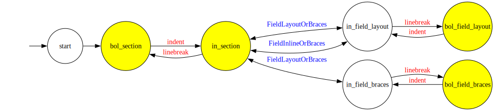

+++
title = "Comment Preserving Cabal Parser"
date = 2025-12-25
[taxonomies]
authors = ["Léana Jiang"]
categories = ["Cabal"]
+++

_This article was originally posted on my blog [here](https://confusedcompiler.org/articles/2025-12-comment-preserving-cabal-parser)._
<hr/>

# Motivation
Cabal [^1] is the standard package system for Haskell software, it is similar to Cargo from the rust
world, or OPAM if you come from OCaml.

Cabal reads cabal package manifests in the cabal format (with the extension `.cabal`).
However, it is currently unable to modify it loselessly: comments are lost, imports are
fused and written in place, `elif` in a conditional will be desugared to a nested `if` in an `else`.

For this reason, critical features such as adding modules to the .cabal manifest or generating
package dependency bounds are implemented poorly.\
For example, cabal emits a warning when a module is not listed in the manifest, but it can't apply
the fix the warning indicates for you.\
Furthermore, `cabal gen-bounds` (which generates dependency bounds that are not specified) doesn't
write dependency bounds information directly to the cabal file, it dumps them to the terminal.
Frustrating!

If we use the current pretty printer in cabal to try to implement these features, the resulting
cabal manifest will be mangled.
This is because cabal can't do _exact printing_ yet.
Concretely this means the spaces and empty lines, comments, common stanzas, and if conditions that
you add will be lost.
Adding an exact printer will allow cabal to modify the cabal files automatically and loselessly!

An exact printer is a special kind of pretty printer.
It uses concrete syntax information in the in-memory representation to output a file that is
byte-to-byte identical to the file originally parsed.
To do that, its corresponding parser must store enough information in the in-memory
representation.
Formally, the exact parser/printer combination obeys the law presented below.
```hs
forall cabalFile.
  IsValid cabalFile =>
    exactPrint (exactParse cabalFile) == cabalFile
```
This reads as "forall valid cabal manifest, the operation `exactPrint . exactParse` should output a
file that is byte-to-byte identical to the original".

Furthermore, we also aim to allow modification to the in-memory representation. Unmodified parts of
the representation will be printed out verbatim to the original parsed cabal file.

This property is crucial for tools to be able to manipulate cabal files programmatically:
adding dependency, export a module, or generate package bounds just to name a few.

A tracking issue was opened in cabal's repository since 2021 [here](https://github.com/haskell/cabal/issues/7544).

In order to achieve introducing an exact printer, the first step is to preserve concrete syntax information. For example,
comments must not be altered, comma style in comma-separated fields must be preserved, blank spaces
and blank lines should be preserved.

[Jappie](https://jappie.me/) started doing a prototype that works well since 2024 Zurihac.
The proposal has matured enough and was accepted by the Haskell Foundation, the current step is
to implement it in Cabal. =D

The following sections will be talking about handling comments in the parser and lexer. The current
parser doesn't handle comments at all. In fact, the lexer drops them and the parser never sees them.

# How the cabal parser works
There are three main parts to the cabal parser, namely the lexer, the field parser, and the field
grammar parser.

The lexer is written in [Alex](https://haskell-alex.readthedocs.io/), a lexer generator for Haskell.
Using a lexer generator has the advantage to write a set of production rules without thinking
about their ordering or ambiguity, Alex will detect inconsistencies during the generation of the
lexer. The lexer produces a stream of `Token`s.

The field parser is written in plain Haskell. It calls the code generated by Alex, consuming the
produced `Token`s. The top-level (entry point) of field parsers is `readFields`. It produces a
stream of `Field ann` where `ann` holds some annotation related to the field. Before this work on comment
preservation, `ann` is instantiated as `Position` which represents the row and column of the source
code where the field is seen.

The field parser not only interacts with the lexer by consuming `Token`s, but also by changing its
state.
Modeled as an automaton, Alex allows users to set "state", or "start codes". Each production rule in
Alex can switch state and either produce a `Token` or nothing (drop the token for the parser to
never see it). The field parser sets the state of the lexer upon seeing certain `Token`s that give
hint to the following context.
This has the benefit of producing better lexical error messages because the lexer "is more
knowledgable" thanks to the parser, but also makes the logic a bit intertwined and less
straightforward. In cabal's case, certain states are inaccessible without the parser deciding to
transition to it.

The lexer and the field parser together handles the cabal envelope format. Imagine if today cabal
were to not use its own format and uses something like TOML like Cargo from Rust does, this format
is the equivalent of TOML.

The inner format is founded on the "field grammar", it handles things like "which field should be
defined for a cabal file to be a package description", "which field can be defined multiple times
with its values merged together", "which fields contains comma separated values or dependency bound
description", and so on.

This inner format is handled by the field grammar parser.
It is a lot less straightforward than the two aforementioned parts and is primarily defined with
type classes. The `FieldGrammar` type class describes how the pretty printer and parser should
behave, two birds one stone! [^2]


# How we achieved comment-preserving parsing
Prior to the work on comment-preserving parsing,
comments are dropped by the lexer and no other parts down the pipeline can see any comments.
To preserve comments, we must go against this prior design by making the lexer emit comments.

We also need to store the comments somewhere in the output of `readFields` which outputs
`[Field Position]`.

The `Field ann` data type is defined as follows
```hs
data Field ann
  = Field !(Name ann) [FieldLine ann]
  | Section !(Name ann) [SectionArg ann] [Field ann]
  deriving (Eq, Show, Functor, Foldable, Traversable, Generic)
```

Originally, Jappie's prototype adds another constructor `Comment !ByteString` to hold a
comment. This was quite straightforward (exactly what we want in a prototype!) but it also
introduced subtle footguns: all code that depend on the `Field` data type now has to deal with
with `Comment`s.

With help from Andrea, we changed the design to maintain the original definition of `Field ann`,
while instantiating `ann` differently.
Previously this type variable was `Position`; by changing it to `([ByteString], Position)`, we were
able to store comments without polluting all usages of `Field ann` with the `Comment` constructor!
Concretely we decided to give this pattern a type to disallow uses of `Data.Bifunctor.first` and
`Data.Bifunctor.second`, as it can be less straightforward.
The `WithComments ann` type is as follows:
```hs
data WithComments ann = WithComments
  { justComments :: ![Comment ann]
  , unComments :: !ann
  }
  deriving (Show, Generic, Eq, Ord, Functor)
```

A minor downside with the _comments-in-`ann`_ model is that a file with no field but only comments
can't be represented. However we don't consider this case because such a file won't be a valid cabal
file.

We change the top-level field parser `readFields` as follows:

```hs
-- Old definition is kept with the same type
readFields :: B8.ByteString -> Either ParseError [Field Position]
readFields = (fmap . map . fmap) unComments . readFieldsWithComments

-- New comment-preserving alternative for the exact printer (and/or other future tooling interested in comments)
readFieldsWithComments :: B8.ByteString -> Either ParseError [Field (WithComments Position)]
readFieldsWithComments = fmap fst . readFieldsWithComments'
```

# Tracing out lexer states
The current cabal already "handles" comments, the problem is that it drops them.
This is good news because we only need to change the right hand side of the production rule to retain
the comments from the lexer. We don't have to worry that our modifications will alter the syntax of
cabal.

I traced out the automaton graph to see where comments can occur, and added them to the field parser.


The start state is used to handle BOM only once and for the purpose of comment parser we can ignore
it.
In the graph, edges with red labels are transitions made by the lexer with its own information; on
the other hand, edges with blue labels are transitions made by the field parser knowing what token
it just saw. The states colored in yellow can emit comments.

Having this diagram is very useful as it tells us how the different contexts relate to each other,
and clarifies which locations can contain comments in a Cabal file.

`FieldLayoutOrBraces` and `FieldInlineOrBraces` would start in `in_section` state, switch to
`in_field_layout` or `in_field_braces` depending on the context and run a parser, and finally switch
back to `in_section`. To annotate this we use a double ended edge because the transition condition
isn't visible from the lexer context.

# Functor multiplicity is a footgun
`Field ann` is a functor, so doing `fmap` on `Field (WithComments Position)` we can alter the
annotation on a field, right? Hold on! Let's look at the `Field ann` type again.

```hs
data Field ann
  = Field !(Name ann) [FieldLine ann]
  | Section !(Name ann) [SectionArg ann] [Field ann]
  deriving (Eq, Show, Functor, Foldable, Traversable, Generic)
```

`ann` is used everywhere, especially in `[FieldLine ann]` and `[Field ann]`.
This means if we fmap and attach comments to a `Field`, its first and second arguments will all have
the same comments attached!

I think there's no way to avoid this, since it's still convenient to have a functor instance.
The moral of the story is that you must have a clear understanding of the instances of the data
types you're using.


# Conclusion and future work
`GenericPackageDescription` is the final representation of a parsed cabal file.
To preserve `Eq` extensionality [^3], we wrap it with a data type which isn't an instance of `Eq`.
Otherwise, a `GenericPackageDescription` would be considered different when the comments are
different!

We duplicate the top-level parsing functions so we have one entry-point that parses
annotation (`parseAnnotatedGenericPackagedescription`), and another one that doesn't
(`parseGenericPackageDescription`) to provide backward compatibilty.

```hs
data AnnotatedGenericPackageDescription = AnnotatedGenericPackageDescription
  { exactComments :: Map Position ByteString
  , unannotatedGpd :: GenericPackageDescription
  }
  deriving (Show, Data, Generic)
```

Since the position of all comments should not overlap, we create a map out of the comments indexed
by their `Position` in the source file. This is necessary to reconstruct the comments in the source
file and achieve exact print.

This change to the lexer and parser is isolated, meaning you can already use the comments when this is
merged. However more work needs to be done for a complete exact print feature!
Namely we need to stop common stanzas from being merged in.
Currently I am working on a prototype to retain trivia in field grammar parser, so the spaces in
dependency bounds won't be dropped, for example.

Please tell me if you have any thoughts on this work. :)

I want to thank the the Haskell Foundation and Jappie for allowing this work to happen.
I appreciate greatly the opportunity to work on cabal and solve a problem that helps Haskell
programmers. :)
I also want to thank the people in my life who believed in me when I needed help, without you I
wouldn't be who I am today. :)

[^1]: Common Architecture for Building Applications and Libraries, _Cabal_
[^2]: The printer part doesn't even work like we mentioned in the pre-amble,
    Jappie told me to say to you all it's a lovecraftian horror.
    It's Gods justice for our collective sin.
    If you wonder what an abyss of despair looks like, Jappie invites
    you to open [pandora's box](https://hackage-content.haskell.org/package/Cabal-syntax-3.16.0.0/docs/Distribution-FieldGrammar-Class.html).
    This is your humanity. The face of God. To know it is to know madness.

[^3]: <https://en.wikipedia.org/wiki/Extensionality>
