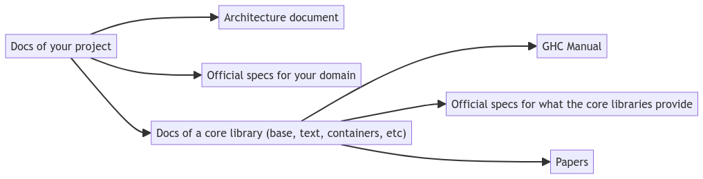

+++
title = "Documentation Best Practices in 2024"
date = 2024-09-15
[taxonomies]
authors = ["Hécate"]
categories = ["Haddock"]
tags = ["Practices", "Documentation"]
+++

In the Haddock team, part of our mission is to help with writing documentation, and promoting best practices. This article will help you write the best documentation you can!

<!-- more -->

We  adapt documentation outside practices to our ecosystem, and leverage our own technologies to empower Haskell users with their documentation work.

Let us see some of these techniques, and how the Haddock team can be of help.

## Writing documentation for your software project

### Justify yourself

When you create software, there is a pipeline from your brain straight to your code. Your decisions — such as the libraries you’ve used,
or your program architecture — shape how your code is structured and written.

Unfortunately, simply writing the code isn’t enough.The reasoning behind the decisions you made is as important as the decisions themselves. In the short term, solving a problem may let you move ahead immediately, but what keeps you on the correct path is understanding what
brought you to that solution.

Indeed, your choices may not be as popular as you think they are! Of course, you decided on them because you already convinced yourself
that they’re best. But you have a user base to convince as well, and they may not see things the same way you do.

As such, it is vitally important to document which decisions you made and to justify why you made them. If it’s not immediately obvious 
why a behaviour or a pattern exists, future maintainers might be tempted to drop it — only to discover too late why it was needed.

### The reference flow of documentation

Not all types of documentation have the same life cycle. Different pieces of documentation are more or less stable, and this determines
which can act as a conceptual and theoretical foundation for your project.

#### Stable documentation

* A README without code
* A vision statement
* The value proposition and the core domain

These ought not to change much, because they describe the basic problems that your code aims to address, solve or support in the long run.
While it is normal to fiddle around with the boundaries of your project at the beginning, in general these should change infrequently.

#### Volatile documentation
* Documentation generated at runtime
* Code examples
* Tests
* Configuration

These  are *expected* to change frequently, as your project changes, your API evolves, and you change configuration options.
Volatile documentation is expensive to maintain, but also very valuable, as it shows in a concrete way how the user can interact with
your project.


> “When you refer to something, make sure the direction of the reference is from the more volatile to the more stable elements”
>
> -- Cyrille Martraire, Living Documentation, 2019


#### Documentation cascade

Here is a simplified model of the documentation cascade for a typical Haskell project, from the most volatile to the most stable
sources:



<details><summary>Code for this diagram</summary>

```markdown
flowchart TD
  A[Docs of your project]
  B[Architecture document]
  C[Official specs for your domain]
  D["Docs of a core library (base, text, containers, etc)"]
  E[GHC Manual]
  F[Official specs for what the core libraries provide]
  G[Papers]

  A --> B
  A --> D 
  A --> C

  D --> E
  D --> F 
  D --> G
```
</details>

This can be read as:

> The Haddocks of your library or a third-party library have a dependency on the official specs for the domain, on an architecture document,
> and on haddocks from the core libraries (`base`, `text`, `containers`, etc.).
> The haddocks of these core libraries depend on the GHC manual, official specs for their own domain, and papers.

Keep in mind that while the Haddocks of a project can refer to the project specs, or to an architecture document, these documents should
never refer to the project's current implementation. If you must refer to the code, point to where it's located.
The (current, volatile) code cannot be the justification for the (planned, stable) architecture.

The GHC manual is much more stable than the haddocks of a Core library, which is why documentation should flow from
the library to the manual.

Finally, papers serve the same purpose as architecture documents, where they describe techniques that may be implemented,
but they should not point to code that is subject to change – lest they  point to a library that has evolved so much
that it no longer relates to the paper.

#### Example: The Set data structure

The [Haddocks for the `Set` datatype](https://hackage.haskell.org/package/containers-0.6.5.1/docs/Data-Set.html)
(from the `containers` library) are an example of documentation which follows this model well:

* They point to an overview of the API ([here](https://haskell-containers.readthedocs.io/en/latest/set.html): _volatile_)
* They refer to the papers that have informed the design of its implementation (_stable_)

### Understand for whom you write


> -- Diátaxis Framework, by Daniele Procida, [diataxis.fr](https://diataxis.fr)

It is of utmost importance that documentation answers the needs of the users, and for that we must understand these needs.
Users need specific kinds of documentation depending on the situation they are in.

The above quadrant is the Diátaxis Framework, which maps out the entire life cycle of one’s interaction with a system, a program or a library.
It defines four types of documentation where each are a combination of _Acquisition_ or _Application_, and _Action_ or _Cognition_.

#### Tutorials
If a new user in need of actively acquiring some practice with the project, they can safely be pointed to the "[Tutorials](https://diataxis.fr/tutorials/)" part
of your documentation: it is the part that focuses on "_Acquisition_" of knowledge through "_Action_".
The focus of the tutorial is to make a prospective user acquire basic competence in handling the software: It is an ice-breaker.

#### How-to Guides
Someone who needs to perform a task that new to them, but well-known to their group or organisation, will be best served by "[How-to Guides](https://diataxis.fr/how-to-guides/)",
which helps a user get something done in a safe and correct manner. As opposed to Tutorials, How-to Guides are directions that take into account the complexity of the environment
surrounding the the user and the action, instead of providing a single path from point A to point B.

#### Explanations
However someone who is in need of a deeper – but perhaps less immediately applicable understanding of the project –
will be better served by the "[Explanation](https://diataxis.fr/explanation/)", which serves the need for thought (or _Cognition_)

Explanations bring historical and technical context to the current state of affairs.

#### Reference
Finally, a "[Reference](https://diataxis.fr/reference/)" is a description of the interfaces and mechanisms of the software.
It aims to provide factual informations that is authoritative, with no space for doubt or ambiguity or design questions.
The best way to obtain reference is to make the system aware of its inner workings, and have it spit the reference from its own code.

Through the lens of Diátaxis, the module API documentation produced by Haddock is a Reference.

The [OpenAPI standard](https://swagger.io/specification/) for documenting REST APIs is also a Reference, although some less fortunate systems find themselves 
with no ability to understand their own mechanisms, and thus must rely on manually-written specifications.
In Haskell, packages like [openapi3](https://flora.pm/packages/@hackage/openapi3) help with rendering an OpenAPI specification,
whereas companion libraries for web servers like [servant-openapi3](https://flora.pm/packages/@hackage/servant-openapi3) 
provide you with a way of declaring REST APIs that can be rendered, even at run-time.

#### Do Not Write The One Documentation

It is not just about filling out all the quadrants like a checklist (although they are all good to have!).
Instead, it is about understanding how each section focuses on a particular combination of user needs and situations.

The message of Diátaxis is that you are not meant to write The One Documentation that covers everything — 
inevitably, this produces documentation which is shallow due to its breadth. Instead, focus on the strategic aspects of your documentation,
and you will produce documentation of better quality, with a clear purpose that it can fulfill more easily.


## Reach Out

Should you need any help in writing or proof-reading documentation, please stop by the [Matrix chatroom](https://matrix.to/#/#haddock:matrix.org) of the Haddock team,
or ping us with the [@haddock](https://gitlab.haskell.org/groups/haddock/-/group_members?sort=last_joined) group tag on the
[Haskell Gitlab](https://gitlab.haskell.org/). We would be more than happy to lend you a hand and discuss how to best serve your users,
you included.

## Read More

* [Haddock manual](https://haskell-haddock.readthedocs.io/latest/)
* [The theory behind Diátaxis](https://diataxis.fr/theory/)
* [How to contribute to Haddock](https://gitlab.haskell.org/ghc/ghc/-/blob/master/utils/haddock/CONTRIBUTING.md?ref_type=heads)
