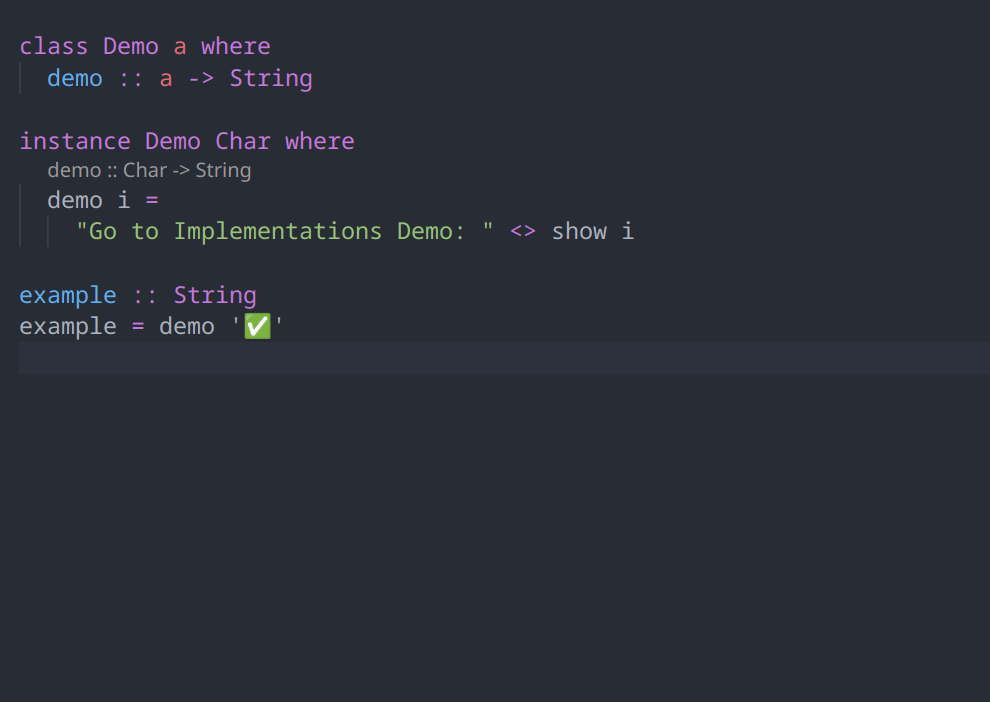
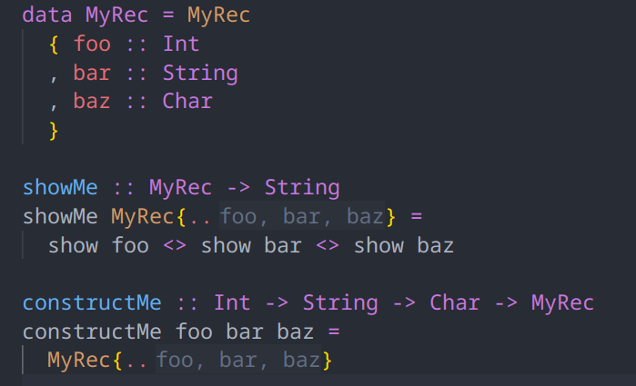
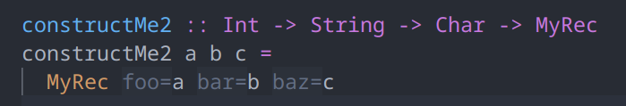
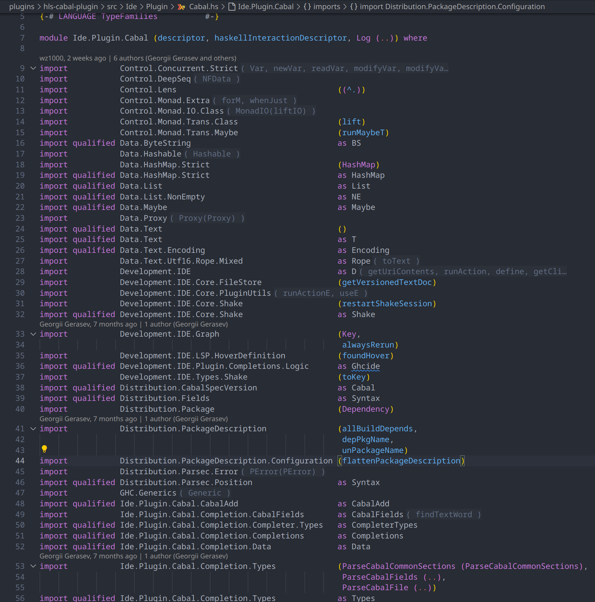
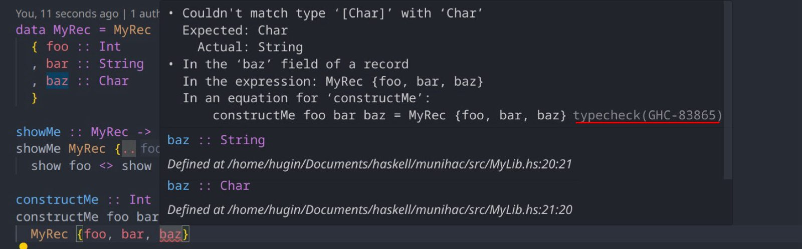

+++
title = "Haskell Language Server 2.10.0.0 release"
date = 2025-04-15
[taxonomies]
authors = ["Fendor"]
categories = ["HLS"]
tags = ["Release"]
+++

The HLS Team is proud to announce the new release of the Haskell Language Server `2.10.0.0`!

<!-- more -->

The last release of HLS was quite some time ago, back in July of 2024.
Thus, this release has quite a number of new features, some of which we would like to highlight for you.

## HLS `2.10.0.0`

The release `2.10.0.0` supports the following GHC versions:

* `9.12.2`
* `9.10.1`
* `9.8.4`
* `9.6.7`
* `9.4.8`

We expect `2.10.0.0` to be the last HLS release having support for GHC `9.4` versions.

### Go to Implementations

We added support for a new LSP feature called `Go to Implementations`.
This LSP feature allows you to jump to the implementation of overloaded functions.

### Inlay Hints

Inlay hints allow you to display additional information within a line of code.
These can be an elegant alternative to code lenses, which display additional information as a separate line above the actual line of code.
For GSoC 2024, `jetjiinser` added inlay hints for various Haskell constructs where additional information can be provided.

Inlay hints are enabled by default in editors that support them, and some plugins, like the `explicit-imports` plugin, have been updated to use the new inlay hints instead of code lenses if possible.

#### Record Wildcards

When [`RecordWildCards`](https://downloads.haskell.org/ghc/latest/docs/users_guide/exts/record_wildcards.html#extension-RecordWildCards) are enabled, it can be tricky to tell which functions are brought into scope.

Inlay hints are convenient to show exactly which variables have been added to the scope.

#### Record construction

One more example showing the convenience of inlay hints.

#### Imports

Inlay hints are also an alternative to code lenses in many situations, for example for showing which identifiers are actually used from an `import`:

### `hls-cabal-plugin` features

The `hls-cabal-plugin` provides language features for `.cabal` files.

During GSoC 2024, `VenInf` added many new features to HLS' support for `.cabal` files.

Moreover, during hackathons such as MuniHac and ZuriHac, a lot of other developers also took the time and effort to fix bugs and contribute new features to the `hls-cabal-plugin`.

#### `.cabal` file outline

The outline on the left shows an overview of the contents of a `.cabal` file.
A small quality-of-life improvement.

#### Support for `cabal-add`

HLS now offers a convenient code action which allows you to add a new dependency to your `.cabal` file, without having to open it yourself.

After executing the code action, we see that the `.cabal` file has been modified:

#### Hover for Dependencies

A tiny, new feature: hover for dependencies in `.cabal` files.
It shows a link to the `Hackage` documentation of a package.

This is mostly a proof of concept, we expand on this idea in [PR #4428](https://github.com/haskell/haskell-language-server/pull/4428).

### GHC Structured Errors

This release is also the first release which uses GHC's structured errors infrastructure.
You might not notice this at first as an end-user, as it is a rather technical detail mainly concerned with refactoring internals of HLS to provide many of its features based on structured error messages, improving accuracy and maintainability of HLS.

But it also has the useful side effect of allowing us to integrate with [the Haskell Error Index](https://errors.haskell.org/):

For anyone wondering how HLS is providing code actions and other LSP features without structured error messages... the answer is [lots of GHC version dependent regexes](https://github.com/haskell/haskell-language-server/blob/master/plugins/hls-refactor-plugin/src/Development/IDE/Plugin/CodeAction.hs#L975).

We want to replace most of these regexes with structured errors.
Do you want to help? Pick an HLS plugin and hack away!
The [PR #4472](https://github.com/haskell/haskell-language-server/pull/4472) is only the beginning of our efforts!

### Fixed

HLS has lots of bugs. In each release we fix a couple and we introduce a couple of new ones.
We can't list all bug fixes, so let's just list a few important ones:

* [Bugfix: Explicit record fields inlay hints for polymorphic records](https://github.com/haskell/haskell-language-server/pull/4510)
* [Implement fallback handler for `*/resolve` requests](https://github.com/haskell/haskell-language-server/pull/4478)

## Thank you, Haskell Community

We wish all Haskellers happy hacking while using the latest release of the Haskell Language Server `2.10.0.0`!

We want to thank our countless contributors from the community and our Google Summer of Code participants!
This is a community project, and the HLS team is grateful for every contribution, be it documentation, bug fixes or new features.

Finally, a reminder that you can donate to the development of HLS via [OpenCollective](https://opencollective.com/haskell-language-server).
The OpenCollective money pays for tedious, but important maintenance work and, sometimes, for getting new features over the finish line.
