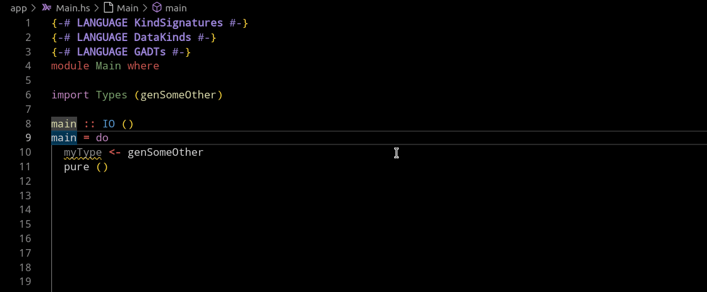
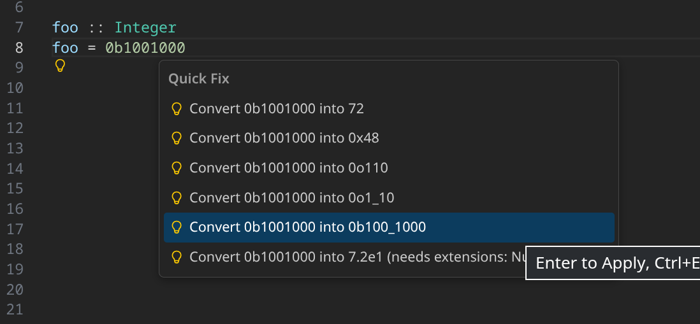

+++
title = "Haskell Language Server 2.13.0.0 release"
date = 2026-01-26
[taxonomies]
authors = ["VeryMilkyJoe"]
categories = ["HLS"]
tags = ["Release"]
+++

The HLS team is happy to announce the 2.13.0.0 Haskell Language Server release which introduces two new exciting features!

<!-- more -->

## 2.13.0.0 features

#### Go-to type via hover message

This is a neat new feature, which adds clickable links to the different types in a type signature when hovering over it.
You can then jump directly to the type you want to explore further by directly clicking the link in the hover pop up.

Thank you very much to @dnikolovv for this contribution in [#4691](https://github.com/haskell/haskell-language-server/pull/4691)!

#### NumericUnderscores support for literals

We introduce additional code actions for better support of number literals, which offers to split the literal with underscores for better readability.

The split is sensitive to the number system of the selected literal and to make life even more comfortable the code action also offers to add the [NumericUnderscores](https://ghc.gitlab.haskell.org/ghc/doc/users_guide/exts/numeric_underscores.html) pragma for you if it is not already enabled!

We want to thank @crtschin for implementing this feature in [#4716](https://github.com/haskell/haskell-language-server/pull/4716)

## 2.12.0.0 changes

Since we did not post about the rather chunky 2.12.0.0 HLS release, we also want to highlight some of the changes, bug fixes and even refactors that some haskellers might have missed.

### Features

#### Signature help

Another very cool new feature, implemented during 2025's Google Summer of Code by @jian-lin, is signature help.

When viewing an applied function, users can now request information on the type of the respective argument on hover.
This will also show users the comments related to the respective arguments if the function is sufficiently documented.
Even better, this feature also works on infix functions!

This feature was implemented in [#4626](https://github.com/haskell/haskell-language-server/pull/4626).

<video controls width=70%>
  <source
    src="signature-help.webm"
    type="video/webm"
    alt="A simple 'Demo' type illustrating that the different parameters of a called function are highlighted in the function's type signature on hovering the respective passed arguments." />
</video>

Signature help is unfortunately currently buggy in do-notation statements and ready to be picked up by any interested Haskellers who want to help make HLS even better 🙃.

#### Go-to references for notes

Not all Haskell programmers may make use of them when coding but someday you might try to understand a large codebase such as GHC and encounter references to notes in the documentation.

Notes are big chunks of documentation which are often explanations about some concepts or design decisions in a whole module instead of just explanations on a singular function and can be referenced in any comments.

HLS can now help in making the encounters with such references more efficient by allowing users to jump to the referenced notes via a go-to reference request.

We are very grateful to @jvanbruegge for introducing this feature in [#4624](https://github.com/haskell/haskell-language-server/pull/4624).

### Some notable bug fixes

- When renaming constructors of a data structure, the data structures fields will no longer be renamed to all have that new name ([#4635](https://github.com/haskell/haskell-language-server/pull/4635)).
- HLS now recompiles faster by consistently adding the `-haddock` flag which avoids unnecessary recompilation ([#4596](https://github.com/haskell/haskell-language-server/pull/4596)).

### Refactoring

In 2.12.0.0 there was a big community effort, also due to the effort of a lot of ZuriHac participants, to use structured diagnostics wherever possible in the HLS codebase.

We want to thank all of the contributors who helped make the HLS codebase more unified and easier to understand!
The tracking issue can be found in [#4605](https://github.com/haskell/haskell-language-server/issues/4605).

### Supported GHC versions in 2.12.0.0 and 2.13.0.0

- 9.12.2
- 9.10.1
- 9.8.4
- 9.6.7

## Thank you, Haskell Community

We wish all Haskellers happy hacking while using the latest releases of the Haskell Language Server, and hope to see you in the issue tracker or even in some pull requests!

Again, a big thank you to all contributors and last year's Google Summer of Code participants for helping improve HLS in any way, be it documentation, bug fixes or new features.

Finally, a reminder that you can donate to the development of HLS via [OpenCollective](https://opencollective.com/haskell-language-server). The OpenCollective money pays for tedious, but important maintenance work and, sometimes, for getting new features over the finish line.
