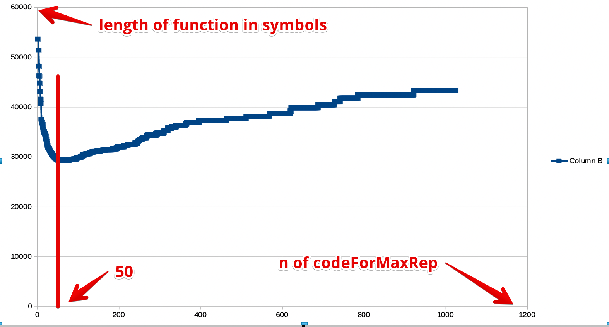

+++
title = "JavaScript Code Minification Report"
date = 2024-09-15
[taxonomies]
authors = ["Serge S. Gulin"]
categories = ["GHC"]
tags = ["activities-report", "javascript"]
+++

The JavaScript world has been battling for low bundle size from the very beginning.
It is now our turn to enter the battle

<!-- more -->

__Dedicated to all front-end developers who doubt, but.__

## Intro

The JavaScript backend in GHC has a long history of various challenges. One of the most notable is the transition from GHC 8.x to 9.x. Significant work has been done up to today by the GHC team, and progress is still ongoing. Besides the obvious need to make the GHC JavaScript backend functional in general, some specific issues have been raised regarding its use in production, one of them being the size of the produced JavaScript bundles.

Bundle size is an important consideration when commercial applications face challenges in delivering to end users. It is not surprising that consumers pay attention to software user experience. First impressions matter, and the time required for a fully functional interface to appear on the user's device is crucial.

Web applications are particularly sensitive to the duration before user interactions can begin. When you are loading a site or web application, you [expect it to be fast](https://www.browserstack.com/guide/how-fast-should-a-website-load). Bundle size is a primary target for loading time optimizations, due to the fact that, at this point, you have little control over what to offer the user while the progress bar is filling up.

## Bundle Size Challenge

The JavaScript world has been battling for low bundle size from the very beginning. Various tactics have been developed up to today. Everyone who has participated in web development has heard words like minification, obfuscation, compression, and code elimination. Each of these terms opens a door to a wide array of tools whose configuration can take a long time and requires special experience: the resulting bundle should not only be lightweight but also functional.

Roughly speaking, we can categorize all these tools and approaches into the following set of practical actions:
1. **Code rewrite**. Simple approaches are known as minification. They are based on the fact that JavaScript supports pulling all code into a single line by removing whitespace. More intelligent approaches swap variable names for shorter ones. A side effect of this is that it makes reading such code harder, which in itself is a practice known as obfuscation. Even more advanced tools support unused (dead) code detection, allowing it to be safely removed. How can this happen? Third-party libraries provide various functions, but a specific application uses only a subset of them. The most advanced tools take things a step further: they can detect some code that can be rewritten in a more optimal form according to its actual use cases. For instance, if you use a constant variable, its value can be substituted directly in a call. In that case, the variable definition itself is not important and can be omitted, with its value used in place (inlined).
2. **Environment-dependent graceful degradation**. The runtime environment can vary significantly due to different browsers and their versions. Sometimes you have control over the user's runtime environment, especially if the application is targeted at commercial clients. More often, your runtime environment is very diverse. Different environments impose different restrictions. Rich (and probably more modern) environments provide a large set of built-in features. The way you deliver your programs could depend on these features, as they can help build optimal bundles where your code does not have to implement low-level behaviors from scratch. Such code can have shortcuts for features where there is no need to include the full implementation, which would add more to the bundle. For example, [internationalization](https://developer.mozilla.org/en-US/docs/Web/JavaScript/Reference/Global_Objects/Intl) (i18n) can be supported by some targets, so you do not need to add a full implementation in your code. This approach encourages modern user environments with faster load times, but for others, it makes things "just work" at the cost of bundle size. Web servers can detect browsers and their versions to select the best bundle size using the `User-Agent` header.
3. **Network-level compression**. The simplest approach to reducing load time is to use good old compression, usually gzip compression. There is no need to deal with code optimizations. Most environments support it "out of the box" through the provided `Content-Encoding` header. It has its own weakness: the time to unpack the application on the client side. However, such a concern has become less important these days, thanks to modern CPUs—even on low-budget devices.
4. **Dynamic bundle loading**. This is the last but not least option when no other ways give you satisfactory results in the battle for short loading times. Usually, even large applications can be split into smaller parts that can be loaded as the user navigates through the interface. It is an old approach used on the Web: hypertext itself encourages this way of loading time optimization. Modern web applications can be designed to load their parts one by one if the tools used support partial loading.

## JavaScript ecosystem

As mentioned in the previous part, the modern JavaScript ecosystem provides battle-tested approaches to dealing with bundle size. The most notable ones that come to mind include:

1. [Terser](https://terser.org/), [UglifyJS](https://www.uglifyjs.net/), and [Google Closure Compiler](https://developers.google.com/closure/compiler). All of them provide methods to transform code into a minified form, ranging from trivial optimizations to more advanced techniques like dead code elimination.
2. [Babel](https://babeljs.io/) for environment-related optimizations. Its primary purpose is to construct a set of "polyfills" that ensure uniform code execution across environments with different capabilities. Babel does not know a priori which capabilities an environment has, but it can be configured declaratively at build time to specify which features are expected to be present or not. One possible scenario for its usage in the task of bundle size reduction is to categorize possible environments into classes and prepare specific builds for each class. Bundle selection for delivery can be fulfilled by the static content server. For example, this can be implemented with the help of [Nginx](https://nginx.org/en/), where bundles can be associated with the incoming `User-Agent` header.
3. [Webpack](https://webpack.js.org/) ([Parcel](https://parceljs.org/), [Rollup](https://rollupjs.org/)) for bundle combining and splitting. The modern JavaScript environment has [support](https://developer.mozilla.org/en-US/docs/Web/JavaScript/Guide/Modules) for code modularization, but this support is still far from perfect. Even if support becomes more widespread, bundling will probably remain important due to networking: loading one big file generally has fewer side effects on time than loading a set of files with the same total size. Bundlers come into play when your application consists of a large number of modules, which is a common case. Moreover, they add additional value to the application build pipeline: they provide a way to slice a large application into a few bundles that can be loaded dynamically. Such slicing can usually be configured declaratively.
4. [Gzip](https://en.wikipedia.org/wiki/Gzip), [Deflate](https://en.wikipedia.org/wiki/Deflate), and [Brotli](https://en.wikipedia.org/wiki/Brotli) via [Nginx](https://nginx.org/en/) through [fallback](https://bytepursuits.com/nginx-enabling-brotli-compression-with-gzip-fallback) on the `Content-Encoding` header value. Their usage is quite straightforward. It depends only on the selected delivery method. Usually, web servers and content delivery networks handle this task with the best available efforts, so it is very rare that any manual tweaking is needed.

## The Haskell way

Let us return to our primary topic and consider how the Haskell environment takes its own seat with the concepts described above.

**Network-level compression** does not depend on how the JavaScript bundle is generated. It is the most accessible way to address the issue of large bundle sizes. We assume that it is enabled by default and, for measurement purposes, we assume that `Gzip` is used. So, even if the GHC JavaScript backend does not support anything from the list above related to code splitting or code optimizations, we can still improve user experience by reducing bundle loading time through the correct configuration of the delivery channel to use reliable old compression.

> So, there are no troubles here ✅✅.

**Dynamic bundle loading** is a complex topic. The GHC JavaScript bundle does not support it natively. However, real-world JavaScript applications usually depend on other JavaScript libraries and modules. We assume that a Haskell application could depend on them: call their functions, return results to them, and be called from external JavaScript code. Currently, the GHC 9.x JavaScript backend lacks full support for FFI. It allows only functions as JavaScript imports. However, it is enough to construct the interface where JavaScript can call Haskell functions and vice versa. Thus, we cover two possible top-level architecture scenarios:
1. Haskell is used to write modules that will be used by some top-level JavaScript code. Such JavaScript code could be used only for bootstrapping purposes actually. In that scenario, bundlers (i.e., Webpack) could consider Haskell code as an [old-fashioned](https://webpack.js.org/guides/shimming/#global-exports) JavaScript module that operates through globally exported functions. By this assumption, we gain the full power of slicing our application with a bundler, but its atomic slice is limited to the whole JavaScript bundle from the GHC 9.x JavaScript backend because it is a kind of "black box" for the bundler. Thus, it allows you to write different parts of the application in different Haskell modules which could be loaded on-demand from the top-level JavaScript code. The main issue here is to write a correct rule for loading such an "old-fashioned" module. A Haskell module (when Emscripten is used) can contain some global variables which require lots of care from the bundler side to ensure they are loaded sequentially by time but safely "shimmed" for simultaneous usage in the global JavaScript namespace.
2. Haskell is used to write a top-level module that is supposed to be a caller for dependent JavaScript modules. It is supposed that this way is primary for existing commercial frontend applications written in Haskell for the Web. That looks like a straightforward way to begin development but encourages limited benefits from existing JavaScript bundlers. They can be used only to prepare third-party libraries for external calls. The GHC 8.x/9.x JavaScript linker currently does not support dynamically loading dependent Haskell modules on-demand: it assumes that all Haskell code is present statically at the moment of application bootstrap.

> Well, this way of bundle size optimization is limited even if possible. Even if the first strategy is chosen, the process of keeping the bundle configuration correct throughout the development lifecycle will require deep knowledge and lots of patience. Not sure what is more, so 🤷‍♂️.

Accommodation of this tactic will not be covered by the samples in this article, but it could be an interesting journey for developers who participate in large Haskell web frontend application support. If it finds a strong response from the community, it could be investigated further.

**Environment-dependent graceful degradation** is related to the previously discussed topic. Such tools (i.e., `Babel`) in the JavaScript ecosystem tend to be used in conjunction with bundlers (i.e., `Webpack`), but some of them can be used standalone. Their practical purpose for Haskell applications lies in providing a stable environment with all modern features of ECMAScript implemented natively or through "polyfills." Unfortunately, ["ponyfills"](https://ponyfoo.com/articles/polyfills-or-ponyfills) cannot be used with Haskell frontend applications due to the lack of support for CommonJS/ESM modules in the GHC 8.x/9.x JavaScript backend linker. Fortunately, the GHC 8.x/9.x JavaScript backend generates a very simple JavaScript subset. GHC's JavaScript RTS library has been written with ES5 in mind, with minor inclusions of fat-[arrow-style](https://caniuse.com/arrow-functions) functions from ES6. The used ES-language features are broadly supported nowadays. So, if your code does not use third-party libraries in JavaScript (which is supposed to be a rare case for real-world commercial applications), the usage of tools like `Babel` does not seem necessary.

On the other hand, even a `Hello World`-like Haskell application comes with a rich set of built-in modules for everyday use. Some modules of i18n and bigint from built-in libraries could be swapped for ones from a stable environment. This could reduce the size of generated JavaScript bundles for modern environments where "polyfills" are not needed. For older environments, such "polyfills" could be incorporated through declarative `Babel` configuration.

We face two scenarios of graceful degradation tool usage for a Haskell web frontend application:
1. Third-party JavaScript libraries may require them. There is a __dash__ in the JavaScript world. Authors of popular and reliable libraries tend to use the most modern and fashionable ECMAScript features. This adds additional complexity for Haskell application distribution. Such libraries need to pass through tools like `Babel` before being added to the resulting bundle.
2. The Haskell application itself relies on built-in packages, which is fine in terms of reliable execution (one of Haskell's strong sides) but not so well with bundle size when the environment provides native or "polyfilled" implementations for basic functions to work with things like [i18n](https://developer.mozilla.org/en-US/docs/Web/JavaScript/Reference/Global_Objects/Intl) and Bignum ([BigInt](https://developer.mozilla.org/en-US/docs/Web/JavaScript/Reference/Global_Objects/BigInt)).

> In short, this way of optimization has little to do with the Haskell application itself for now. It can be integrated into the resulting bundle compilation to process third-party JavaScript dependencies ✅, but currently, GHC 9.x JavaScript does not support swapping functions from built-in packages with those provided by the environment ❌.

Experiments with this tactic remain out of scope for the current attempt to bring some benefits. Here, the same action is relevant as for the previous one: strong response from the community could drive investigations into this field.

**Code rewrite** is a common tactic for advanced bundle size optimizations. Besides using optimizing compilers like Google Closure Compiler, the GHC 8.x/9.x JavaScript backend offers features to deal with large bundle sizes. The overview of introduced improvements in this area will be covered in the next section of this article and measured. Also, it is important to keep the resulting bundle compatible with existing optimizing compilers (at least one of them) because it provides additional benefits for application developers.

Although a long route still lies ahead, some steps have already come into play nowadays: optimizing compiler support has been fixed, Unicode dead code elimination improved, string representation optimized, and Unicode (again!) table size notably reduced. ✅ Let us see the details in the next section!

## Passed steps for great good

Before anything else, it's necessary to mention that the initial event that sparked this work was an offline discussion where the opinion was formed that even a 100kb total bundle size for a Haskell "Hello World" application is not achievable.

Well, does it really matter? We will measure it with [size-limit](https://github.com/ai/size-limit), which shows sizes and time to load on a bad connection.

We are going to begin from the [latest](https://gitlab.haskell.org/ghc/ghc/-/commit/7d84df86d8c639a9ef442593d4a8c017a2046b92) `master` commit at the time of writing this article. Right on this commit, we will revert the added code optimizations:
1. [#24789](https://gitlab.haskell.org/ghc/ghc/-/issues/24789) Reasoning on Unicode static data compression on the GHC side
2. [#24504](https://gitlab.haskell.org/ghc/ghc/-/issues/24504) Eliminate dependency of "Hello World" on `Read`
3. [#24706](https://gitlab.haskell.org/ghc/ghc/-/issues/24706) Port back more efficient packing of string data from GHCJS to GHC JavaScript backend

The order is important. They were added in reverse order, so applying reverts to related commits reconstructs the whole GHC state. We want to take the most modern (and buildable!) GHC state and see how the JavaScript bundle size is improved over these commits.

Additionally, it's important to note that there is one more significant issue:
* [#24602](https://gitlab.haskell.org/ghc/ghc/-/issues/24602) Google Closure Compiler hard errors

It is important, but it does not add optimizations to GHC itself. It only allows us to run the Google Closure Compiler over the resulting bundle, which we can turn on/off manually during the following steps. We will apply all measurements with and without it to track its necessity.

Our building pipeline will be the following:
1. Build a sample Haskell program with `GHC` optimization option `-O2`.
2. Process `all.js` through `Google Closure Compiler` with `--compilation_level ADVANCED_OPTIMIZATIONS`.
3. Process `all.js` and `all.min.js` (result of the Google Closure Compiler) with `size-limit`.

We will measure the following:
1. The size of `all.js` after the `GHC` pass
2. The size of `all.min.js` after the Google Closure pass
3. The brotlied sizes of them both via `size-limit`
4. The running time via `size-limit` to estimate how hard it is for the browser to load on a low budget device. It uses [estimo](https://github.com/mbalabash/estimo?tab=readme-ov-file#chrome-device-emulation) internally.

Lets do some initial measurements (when no improvements have been applied via the reverted commits on fresh master):

```
$ ls -alhs ./HelloJS.jsexe
... 6.8M ... all.js
... 5.5M ... all.min.js
```

```
$ npx size-limit
✔ Running JS in headless Chrome

  HelloJS.jsexe/all.js
  Package size limit has exceeded by 188.74 kB
  Size limit:   10 kB
  Size:         198.74 kB brotlied
  Loading time: 3.9 s     on slow 3G
  Running time: 9.6 s     on Snapdragon 410
  Total time:   13.5 s

  HelloJS.jsexe/all.min.js
  Package size limit has exceeded by 171.55 kB
  Size limit:   10 kB
  Size:         181.55 kB brotlied
  Loading time: 3.6 s     on slow 3G
  Running time: 7.1 s     on Snapdragon 410
  Total time:   10.6 s
```

Well, results are far from perfect. 10s to load.

Warning for experienced researchers: We are not going to make reliable sigma-based measurements. Their purpose is only to demonstrate the direction of improvements.

### Efficient packing of string data [#24706](https://gitlab.haskell.org/ghc/ghc/-/issues/24706)

To avoid saying the same things twice (you can follow the issue for details) we are going to disclose it in following samples:

```
[72, 101, 108, 108, 111]
```

**VS**

```
Hello
```

You probably noticed that second sample is shorter than first. It was the point of the ticket. It decreases bundle size besides better readability.

To make it happen let us deal how string literals work in `GHC`. They become an int array in a memory address pointer which has type `Addr#` internally. But not only string literals are encoded in an int array (`Addr#`). GHC is smart enough to use same technique for all embedded stuff which can be represented as an int array with a pointer. It can be used for embedded files as well. For anything that can look like an int array.

So, we should detect somehow that `Addr#` is used for string literal representation. Fortunately we are dealing with ByteStrings.  
According to the [best article about strings representation (The ultimate guide to Haskell Strings)](https://hasufell.github.io/posts/2024-05-07-ultimate-string-guide.html) in GHC, we know that a well-formed unicode string should meet the following requirements:
1. Its content should be limited to UTF8 code points.
2. `\0`s are not allowed.

Pretty small change but how important?

Our `HelloWorld.hs`:

```
main :: IO ()
main = print "HelloWorld"
```

Result:

```
$ ls -alhs ./HelloJS.jsexe
... 6.8M ... all.js
... 3.5M ... all.min.js
```

```
$ npx size-limit
✔ Running JS in headless Chrome

  HelloJS.jsexe/all.js
  Package size limit has exceeded by 185.07 kB
  Size limit:   10 kB
  Size:         195.07 kB brotlied
  Loading time: 3.9 s     on slow 3G
  Running time: 7.8 s     on Snapdragon 410
  Total time:   11.6 s

  HelloJS.jsexe/all.min.js
  Package size limit has exceeded by 85.01 kB
  Size limit:   10 kB
  Size:         95.01 kB brotlied
  Loading time: 1.9 s    on slow 3G
  Running time: 8.2 s    on Snapdragon 410
  Total time:   10.1 s
```

Well, our bundle is becoming smaller in size but it remains expensive to load by a low budget device. Note how important it is to use `Google Closure Compiler` for production builds!

### What can be removed from the bundle? Unicode? [#24504](https://gitlab.haskell.org/ghc/ghc/-/issues/24504)

While sifting through the contents of `app.js`, the following was found:

```
var h$ghczminternalZCGHCziInternalziUnicodeziCharziUnicodeDataziGeneralCategoryzilvl_1 = h$rawStringData([25, 25, 25, 25, 25, 25, 25, 25, 25, 25, 25, 25, 25, 25, 25, 25, 25, 25, 25, ...
```

That is a really long line of code! It takes 4,316,351 characters at the bundle. What is even more interesting that Google Closure Compiler was unable to eliminate it as a dead code. It sounded like for some reason as really needed by:

```
main :: IO ()
main = print "HelloWorld"
```

It was a challenge to prove that it was exactly needed by the application. A [special toolkit](https://gitlab.haskell.org/gulin.serge/stg-javascript-backend-visualization) was created for call graph analysis
in JavaScript bundles. Its purpose is very simple: It takes the JavaScript AST, reconstructs actual function calls as STG and creates a [visualization](https://graphviz.org/) 
to be processed by a graph explorer (e.g. [Gephi](https://gephi.org/)).

When the graph file had been constructed, we only needed to find the shortest path between JavaScript `main` and `h$ghczminternalZCGHCziInternalziUnicodeziCharziUnicodeDataziGeneralCategoryzilvl_1`. That route was [found](https://ouestware.gitlab.io/retina/beta/#/graph/?url=https://gist.githubusercontent.com/GulinSS/567c098f636d997636a27c91ac98e272/raw/7207d75459770b36a92242f32d7b4ac56adbe77e/network-425dcff1-968.gexf)!


> Fig. 1. The whole route from main function to Unicode. It demonstrates how much nodes were connected and how. It begins from JavaScript `main` and ends at `h$ghczminternalZCGHCziInternalziUnicodeziCharziUnicodeDataziGeneralCategoryzilvl_1`. Total amount of conntected nodes is 30.

The most interesting node is `h$ghczminternalZCGHCziInternalziUnicodezizdwisSpace`. It means that `isSpace` was the only reason why whole Unicode table had been added to the bundle. And `isSpace` is used by `read` parser. So, when we call the `read` function, that dependency route is triggered to be included into result bundle.

It turned out that the root of this issue came from an [older one](https://gitlab.haskell.org/ghc/ghc/-/issues/24504). With the help of call graph tracing, it was possible to establish the actual reason and [fix](https://gitlab.haskell.org/ghc/ghc/-/merge_requests/12565) it! (Ben Gamari, thank you so much)

Measures:

```
$ ls -alhs ./HelloJS.jsexe
... 2.2M ... all.js
... 387K ... all.min.js
```

```
$ npx size-limit
✔ Running JS in headless Chrome

  HelloJS.jsexe/all.js
  Package size limit has exceeded by 155.23 kB
  Size limit:   10 kB
  Size:         165.23 kB brotlied
  Loading time: 3.3 s     on slow 3G
  Running time: 3.1 s     on Snapdragon 410
  Total time:   6.3 s

  HelloJS.jsexe/all.min.js
  Package size limit has exceeded by 63.92 kB
  Size limit:   10 kB
  Size:         73.92 kB brotlied
  Loading time: 1.5 s    on slow 3G
  Running time: 2 s      on Snapdragon 410
  Total time:   3.4 s
```

73.92 kB! Even more better! But wait.

### What if Unicode is actually needed by some programs? [#24789](https://gitlab.haskell.org/ghc/ghc/-/issues/24789)

As you noted there, it does not require much effort to trigger the addition of the unicode table. A trivial reference to `read` is enough to pull back the whole table back into the bundle.
That victory is too fragile to be proud of given results. Lots of real applications have to use `isSpace` when dealing with text parsing and so on. We have to support this case but keep the bundle size low.

Let us consider the following sample program:

```
main :: IO ()
main = print (read @Int "1337")
```

Here we are facing the issue again.

The variable `h$ghczminternalZCGHCziInternalziUnicodeziCharziUnicodeDataziGeneralCategoryzilvl_1` stores information about the mapping of each Unicode character to its [General Category](https://www.compart.com/en/unicode/category). The number of characters in each category varies. Some categories contain significantly more characters than others. When characters are listed sequentially in memory, their order does not necessarily match the order of the categories. This creates **a challenge**: how to organize characters in memory so that the search for their categories is both fast and space-efficient.

Not many ideas came at the beginning, so a [broad discussion](https://gitlab.haskell.org/ghc/ghc/-/issues/24789) was required with GHC community to see what can be tried to solve this.
Additionally, removing `Streamly` from GHC sources [was needed](https://gitlab.haskell.org/ghc/ghc/-/issues/24910) as well because this dependency didn't keep its API stable.

[Pierre Le Marre](https://gitlab.haskell.org/Wismill) came [with](https://discourse.haskell.org/t/new-library-shamochu-shuffle-and-merge-overlapping-chunks-lossless-compression/9724) [ultimate](https://hackage.haskell.org/package/shamochu-0.1.0.0) [solution](https://github.com/haskell/core-libraries-committee/issues/278) for the problem with large Unicode table but it was considered **too powerful** to be applied right now, so, the time for [shamochu](https://hackage.haskell.org/package/shamochu-0.1.0.0) will come next.

[Sylvain Henry](https://gitlab.haskell.org/hsyl20)'s [approach](https://gitlab.haskell.org/ghc/ghc/-/issues/24789#note_563780), less performant in terms of size reduction gains, was deemed much easier to be implemented. The conclusion was to use the latter one because we needed something easier and without additional dependencies at the moment.

The main idea is to generate better lookup code which can be translated into switches:

```haskell
generalCategory (ord -> n)
  | ...
  | n < 129726  = 21
  | n < 129792  = lookupIntN "..."# (n - 129726) -- variable ranges: use lookup tables
  ...
  | n < 1048576 = 29 -- constant ranges
  | n < 1114110 = 28
  | otherwise   = 29
```

[Sylvain Henry's](https://gitlab.haskell.org/hsyl20) approach was enhanced with nested ifs (logarithmic search vs linear search) and makes estimation regarding the most appropriate chunk size (as he predicted in the origin message):



> Fig. 2. Finding the best size of chunks by comparing all possible values against generated function size. It shows that 50 items is a good-enough value of chunks size.

Measures of applied changes:

```
$ ls -alhs ./HelloJS.jsexe
... 2.8M ... all.js
... 569K ... all.min.js
```

```
$ npx size-limit
✔ Running JS in headless Chrome

  HelloJS.jsexe/all.js
  Package size limit has exceeded by 186.88 kB
  Size limit:   10 kB
  Size:         196.88 kB brotlied
  Loading time: 3.9 s     on slow 3G
  Running time: 4 s       on Snapdragon 410
  Total time:   7.9 s

  HelloJS.jsexe/all.min.js
  Package size limit has exceeded by 86.3 kB
  Size limit:   10 kB
  Size:         96.3 kB brotlied
  Loading time: 1.9 s   on slow 3G
  Running time: 2.5 s   on Snapdragon 410
  Total time:   4.4 s
```

Well, sizes are looking near same after compression but take a look at `Running time`. It looks like new version of unicode code is easier to understand by simulated low budget device!

## Intermediate conclusions

This article shows that community work can yield results that beat the original opinion about "completely unachievable 100kb". We seen how `6.8M` became `2.8M` for uncompressed Haskell JavaScript bundle and how `181.55 kB` became `96.3 kB` for completely optimized, compressed production-ready JavaScript bundle of trivial Unicode-enabled Haskell JavaScript application.

What is next? Besides [adding](https://gitlab.haskell.org/ghc/ghc/-/issues/23479) [various](https://hackage.haskell.org/package/shamochu-0.1.0.0) [code](https://gitlab.haskell.org/ghc/ghc/-/issues/24744) optimizations it would be nice also to consider other options from the beginning:

1. Give a try to slice Haskell applications in chunks, with Webpack dynamic loading as "black box".
2. Consider adding to GHC JavaScript backend the ability to slice code in CJS/ESM modules.
3. Rewrite [call graph visualization tool](https://gitlab.haskell.org/gulin.serge/stg-javascript-backend-visualization) in Haskell and make its output compatible with [webpack-bundle-analyzer](https://github.com/webpack-contrib/webpack-bundle-analyzer/).
4. Extend GHC JavaScript backend Linker with a feature which would switch on/off built-in modules for environments where they can be already provided by platform.

## Thanks!

Thanks for the long reading! It was a very interesting journey and the author hopes now it was for you too, dear reader! Let us meet together in contributing to GHC!

Thanks for people with whom I was much impressed to work (in alphabetical order):

* [Ben Gamari](https://gitlab.haskell.org/bgamari)
* [Cheng Shao](https://gitlab.haskell.org/TerrorJack)
* [Hécate Kleidukos](https://gitlab.haskell.org/Kleidukos)
* [Jeffrey Young](https://gitlab.haskell.org/doyougnu)
* [Luite Stegeman](https://gitlab.haskell.org/luite)
* [Matthew Craven](https://gitlab.haskell.org/clyring)
* [Matthew Pickering](https://gitlab.haskell.org/mpickering)
* [Pierre Le Marre](https://gitlab.haskell.org/Wismill)
* [Rodrigo Mesquita](https://gitlab.haskell.org/alt-romes)
* [Sylvain Henry](https://gitlab.haskell.org/hsyl20)

It is a pleasure to work with all of you on the **Glorious** Glasgow Haskell Compiler! Special thanks for Jeffrey Young who opened a door for me first and invited to work on the GHC JavaScript Backend.

