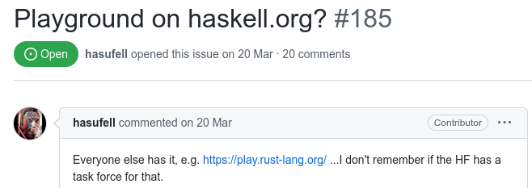

+++
title = "The Haskell Playground"
date = 2024-09-15
[taxonomies]
authors = ["Tom Smeding"]
categories = ["Playground"]
tags = []
+++

The playground ([play.haskell.org](https://play.haskell.org)) allows you to run single-file Haskell programs right from your browser, and share them with others.
In this post, I will introduce the playground and give some implementation details.

<!-- more -->

Being able to run small Haskell programs in a browser is useful if you want to share a snippet of Haskell code with someone in such a way that the recipient can easily read, modify and execute the code.
Another use-case for the playground is if you're on the go (for example at a functional programming conference!) and want to show off some Haskell to your friends.

If those friends are performance-minded, they might ask you what the code compiles to.
Fortunately, the playground can help there too!
By clicking the "Core" button in [the playground](https://play.haskell.org), you can see the intermediate representation that GHC converts all Haskell code to, and where it performs most of its optimisations; it is a stripped-down version of Haskell where everything is explicit.
(Among other things, every memory allocation is marked by a `let` expression in Core; this can be useful to diagnose performance issues.)
If you are courageous, you can even look at the native assembly that GHC generates (with the "Asm" button).

The playground is, of course, [implemented in Haskell](https://github.com/haskell/play-haskell).
The underlying web server is [Snap](https://hackage.haskell.org/package/snap-server), which I like because it's not too heavy-weight (for a web server, that is), and doesn't get in your way much.

## Origins

The roots of the playground are on IRC ([Internet Relay Chat](https://en.wikipedia.org/wiki/IRC)) &mdash; which does, indeed, still exist.
Most of the general Haskell IRC activity is in `#haskell` on [libera.chat](https://libera.chat).
IRC is an old and simple protocol, and multi-line messages are not supported, so what do you do if you want to ask for help with a (multi-line) piece of code?
You put it on a pastebin and share the link.
Which pastebin?

People were using all kinds, and some of the regulars in the channel were complaining 1. that some of those websites were annoying/slow, and 2. that beginners would often only upload half the code, no output, only paraphrase the compiler error, etc.
Thus the idea of a custom pastebin was born:

> &lt;sm> also: a new paste bin customized/structured for #haskell to elicit more info ? eg cabal or yaml file, stack yaml file, command, output, platform.. 
> &lt;tomsmeding> sm: building that pastebin service would be trivial, question is who’d host it 
> &lt;sm> trivial eh :) 
> &lt;sm> if you build it I’ll host it :) 
> &lt;tomsmeding> sure lol

And so [a pastebin](https://paste.tomsmeding.com) was born (still need to chase them up on that offer).
But soon people were back asking for [more stuff](https://github.com/haskell-infra/www.haskell.org/issues/185):

Somehow, this also happened, and it has been running on a small virtual server since then.
For now, this is quite sufficient, but should server load increase in the future, we'll need to re-evaluate.

## Implementation

When I wrote the playground, I was in an optimistic mood and prepared it for horizontal scaling to multiple compilation servers.
For now this functionality is essentially unused (there is just one worker), but it does mean that the implementation of the playground is modularised in two executables:

- The web server (`play-haskell-server` in the [repository](https://github.com/haskell/play-haskell)), which serves the HTML frontend, stores saved snippets in a SQLite database, and accepts compilation/execution jobs from users.
  It distributes these jobs among workers using a thread-pool-like [thing](https://github.com/haskell/play-haskell/blob/master/play-haskell-server/src/Play/WorkerPool.hs), waits for them to complete, and passes the results back to the client.
- A worker (`play-haskell-worker`), which accepts compile/run jobs over the network and handles them on one of the cores of the machine it runs on.
  It simply uses GHCs from [GHCup](https://www.haskell.org/ghcup/), and (hopefully) knows how to properly sandbox the execution of user-submitted programs.

Both server and worker accept connections using HTTP, but that can be easily upgraded to HTTPS in the usual way: put a reverse proxy (such as [Caddy](https://caddyserver.com/) or [Nginx](https://nginx.org/en/)) in front of it and terminate TLS there.
(Caddy has the bonus feature of having built-in support for requesting TLS certificates from [Let's Encrypt](https://letsencrypt.org/), which makes this even easier.)

Let's dive into two more technical aspects of the playground implementation: sandboxing and the build environment.

### Sandboxing

I already mentioned that the worker has to sandbox execution of submitted programs: since the primary functionality of the playground is literally "please execute arbitrary code on my machine", we had better make sure that we can do that safely!
The typical way to do sandboxing nowadays seems to be containers (e.g. using Docker), but those frameworks typically do much more than we need, and have the number of CVEs to match.
So instead, the playground takes the much safer (?) approach of a stack of [three hacky shell scripts](https://github.com/haskell/play-haskell/tree/master/play-haskell-worker/bwrap-files) that successively:

1. Use Linux user namespaces (using `systemd-run`) to set resource quotas: this limits CPU use (to a single CPU core), memory use, and the number of concurrent threads.
2. Use Linux cgroups with [`bwrap`](https://github.com/containers/bubblewrap) (also used by [Flatpak](https://www.flatpak.org/)) to chroot to a Ubuntu distro and prevent access to disk, network, other processes, etc.
   Read-only access is provided to `~/.ghcup`, because that's where the GHCs live.
3. Actually look at what the job is asking for, and do that.

This is convoluted, and it can surely be simplified (without reaching for bloated containerisation solutions).
I just don't know how, so if you do, please reach out.
(And if you'd like to try to break the sandboxing, I'll gladly help you set up the playground on your _own machine_ so that you can test without spoiling the fun for others. ;) )

### The build environment: making Haskell packages available

Having just the [boot packages](https://gitlab.haskell.org/ghc/ghc/-/wikis/commentary/libraries/version-history) available would make for a rather bare playground (no `System.Random`, etc.), so we clearly need to provide something more.
The current policy for additional packages is "if you can convince me that a package is useful that a package is useful and it doesn't unnecessarily bloat the dependency tree, I'll add it together with its transitive dependencies".
This has happened multiple times already (e.g. [1](https://github.com/haskell/play-haskell/issues/45), [2](https://github.com/haskell/play-haskell/issues/47), [3](https://github.com/haskell/play-haskell/issues/50)).
This policy is admittedly completely subjective, but it's unclear if there is a real alternative.
The only "principled" option seems to be making all of [Stackage](https://www.stackage.org/) available, but that is both unwieldy (there's _too many_ packages in there so it takes a huge amount of disk space) and not always possible (the playground aims to support new GHCs immediately after release, and Stackage naturally lags behind).

In any case, we need some way of bringing additional Haskell packages in scope when compiling submitted programs.
One would naturally reach for `cabal` here; a possible design would be to have a Cabal project per GHC version and upon job submission replace its `Main.hs` with the submitted program, after which it is a matter of invoking `cabal run`.
However, this design has some disadvantages:

- To prevent interference when two jobs for the same GHC version arrive at a worker simultaneously (to be handled on separate cores), `(number of GHCs)` projects is not enough: we actually need `(number of GHCs) * (number of cores)` of them.
- The playground not only supports running an executable, but also showing Core and assembly (also for non-`Main` modules).
  While we could modify the `thing.cabal` file together with `Main.hs` to make `cabal` do the right thing, it turns out that `cabal` takes quite a bit of time to reconfigure when the `thing.cabal` file changes.
  To not make the user wait so long, we actually need `(number of GHCs) * (number of cores) * (number of configurations (currently 3))` project directories!
  And if the playground is to support passing additional user-specified options to GHC in the future, then the number of configurations will explode.
  Clearly this will not scale.
- Furthermore, even without needing to reconfigure the project, `cabal` still takes some time to update its own administration for every `cabal run` &mdash; time that is unnecessary because we know exactly what needs to happen: just run the same `ghc` command as before.

Perhaps `cabal` could be improved on that last point, but even without that, there is enough reason for the playground to do something different.
What happens instead is the following:

- I have one Cabal project directory per GHC version, containing a `thing.cabal` file defining an `executable` component that depends on all the packages to be made available.
- Whenever I add a new GHC version to the playground, or want to update package versions for an existing one, I `cabal build` that directory with the appropriate GHC version.
  This yields a `dist-newstyle/cache/plan.json` that contains a wealth of information about the precise dependency tree, including the precise package IDs as found in the Cabal store in `~/.cabal/store`.
  - It is important that this building happens in approximately (!) the same sandboxing setup as the one for the user-submitted jobs, so that paths to the cabal store etc. are the same in both situations.
    I say "approximately" here because `cabal` of course needs write access to `~/.cabal` here, and the user does not.
- These package IDs are [collected](https://github.com/haskell/play-haskell/blob/b02b658ece2c8e4bac7043483f2ca13a4fef6458/play-haskell-worker/bwrap-files/mkbuildscript.sh#L201) and inserted in a generated shell script that invokes `ghc` in precisely the right way to bring those packages into scope.
  As it turns out, `ghc` doesn't really mind getting `Main` or non-`Main` modules here; this means that e.g. Core mode simply appends `-ddump-simpl -ddump-to-file` to the arguments to `ghc`, and everything works fine.

There is thus one such generated shell script for each GHC version on the playground; these are what is actually run when a job is handled by a worker.
This way, the overhead is as low as possible: just `ghc` is invoked, and almost nothing else (apart from the sandboxing machinery).
The overhead from sandboxing is reduced to a minimum by starting a new sandbox immediately after the previous one exited, so that one should be already running (waiting for a program to compile) when the next job arrives.

#### Manual work

The awkward part of the current setup is that I need to manually prepare a consistent package list for each GHC version.
I have some automation for that, but it would of course be nicer if the process of adding a new GHC version to the playground was automatic.

The trouble is that this is actually non-trivial.
As described above, there is a "wish list" of packages that we'd like to be available, but not all those packages build with all GHC versions &mdash; either because they haven't been updated for the latest GHC yet, or because they exist only for certain GHC versions by design (e.g. [ghc-heap](https://hackage.haskell.org/package/ghc-heap)).
It is not obvious how to effectively determine a maximal subset of this wish list that builds together!
Because package dependency constraints need not be monotonic (e.g. package `B` may depend on `A (>= 1 && < 3) || (>= 4 && < 6)`), simply using the newest of each package on the wish list (or oldest, as [some people seem to prefer](https://research.swtch.com/vgo-intro#minimal_version_selection)) is not necessarily sufficient.
This is why the Cabal dependency solver is a [thing](https://hackage.haskell.org/package/cabal-install-solver).

The process of "whittling down" the wish list to something that does build together, guided by `cabal` dependency solving errors, is partially [automated](https://github.com/haskell/play-haskell/blob/master/play-haskell-worker/bwrap-files/dwindle-dependencies.py), but a comprehensive automated solution (that is nevertheless simple enough to maintain and not introduce a slew of robustness bugs of its own) would be nicer.
If you have ideas, please jump into the [issue tracker](https://github.com/haskell/play-haskell/issues/5) and tell me!

## Future

The playground receives a healthy amount of traffic, and it seems to be useful to people, but of course there is a lot that can still be improved.
A number of ideas are already listed in the [issues on the GitHub repository](https://github.com/haskell/play-haskell/issues), but if you have an idea for an improvement that's not yet on the list &mdash; be it to the design, the user experience, or the implementation &mdash; or if you've found a bug and would like to report it, feel free to open an issue.
If you would like to work on the project yourself (and it's more than a one-line fix), please open an issue first; that way we can prevent extra or duplicate work on both sides.

As an example of a recently added feature, the GHC error output on the playground now links to the [Haskell Error Index](https://errors.haskell.org) (for GHC >= 9.6).
(If you get a GHC error, such as [this one](https://play.haskell.org/saved/EQuM159S), click on the link, and find that it has not been explained yet in the Error Index, [they're looking for contributors](https://github.com/haskellfoundation/error-message-index#the-haskell-message-index)!)
Thanks to @MangoIV for [suggesting](https://github.com/haskell/play-haskell/issues/51) this feature.

If you want to say hi, I often hang out in `#haskell` on [libera.chat](https://libera.chat/).
Happy Haskelling!
